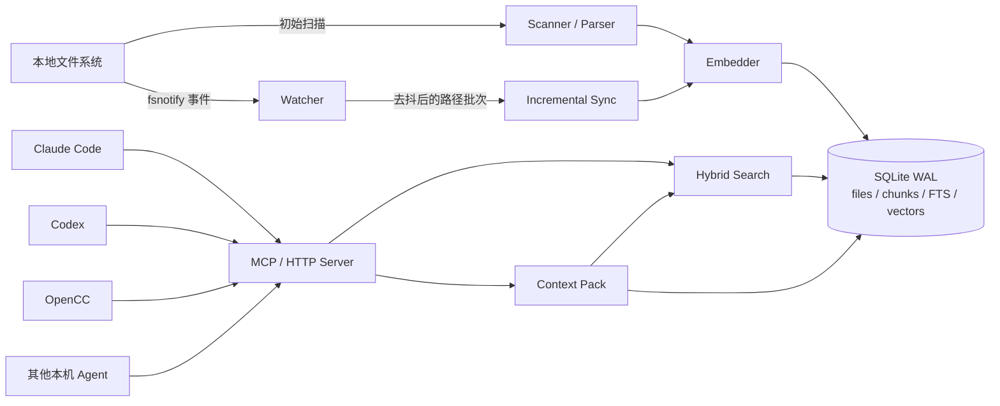
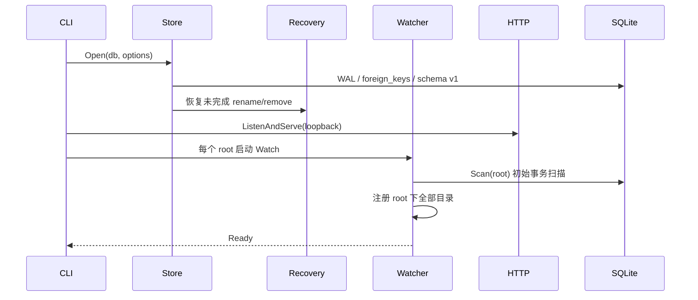

# 总体架构设计

## 1. 目标与非目标

Agent-FS Community 的目标是给开发机上的多个 Agent 提供同一份低延迟、增量更新、可控大小的
私有上下文。核心策略不是让 Agent 反复执行目录遍历与整文件读取，而是在后台持续维护语义索引，
让 Agent 优先通过一次 `context_pack` 获得完成任务所需的相关 Chunk。

当前社区版的非目标包括远程服务、多用户隔离、认证、文件 ACL、审计日志、集中控制面和企业 SLA。

## 2. 系统上下文

进程内只有一个 `Store` 拥有可写 SQLite 连接。daemon 为每个 root 启动一个 watcher，并共享同一个
HTTP server 与索引。HTTP 端只暴露只读检索能力；修改文件的 `rename`、`rm`、`tag` 等操作目前只在
CLI/Go API 中提供。

## 3. 分层结构

| 层 | 职责 | 主要实现 |
|---|---|---|
| 接入层 | CLI、REST、MCP 协议、健康检查 | `internal/cli/cli.go`, `server.go` |
| 上下文层 | 结果聚合、内容加载、Token 预算裁剪 | `context.go` |
| 检索层 | FTS/BM25、向量、元数据召回与融合 | `hybrid.go`, `query.go` |
| 索引层 | 全量扫描、增量同步、Chunk 与向量写入 | `scan.go`, `incremental.go` |
| 内容处理层 | 文本、Go AST、PDF、Office、Embedding | `parser.go`, `embed.go` |
| 一致性层 | 文件变更、操作日志、启动恢复、诊断 | `operations.go`, `recovery.go` |
| 存储层 | SQLite 生命周期、schema、只读查询连接 | `store.go`, `schema.sql` |
| 监听层 | 递归 watch、去抖、批处理和重试 | `watch.go` |

## 4. 启动与请求数据流

### 4.1 daemon 启动

HTTP server 与初始扫描并行启动，因此 `/healthz` 表示服务进程可响应，不等价于所有 root 已完成初始
扫描。需要确认索引内容时，应再执行查询或 `doctor`。

### 4.2 增量更新

1. 扫描和 watcher 在目录入口应用同一排除策略，不进入 VCS、缓存、依赖和构建输出树；非目录条目
   还需通过源码/Markdown/配置文件白名单。
2. fsnotify 产生 create/write/remove/rename/chmod 事件。
3. watcher 将事件路径放入 `pending` map；新建目录还会被递归加入 watch 集合。
4. ticker 等待路径超过 `debounce`，把成熟路径合并为一个批次。
5. `SyncPaths` 对存在的路径重新描述、解析和向量化，对消失/排除路径删除索引子树。
6. SQLite 在一个事务中替换文件、Chunk、Embedding 和关联关系。
7. 临时竞态失败会重新入队，等待下一次去抖周期重试。

### 4.3 检索请求

1. 查询文本被转换为 FTS OR 词项和一个查询向量。
2. 从 `files_fts` 与 `chunks_fts` 召回词法候选。
3. 从同模型、同 sign-LSH bucket 的文件与 Chunk 向量中召回语义候选。
4. 元数据过滤器补充候选并执行最终过滤。
5. 按 `0.52 × BM25 + 0.38 × cosine + 0.10 × freshness` 排序。
6. `context_pack` 读取命中 Chunk 或文件预览，并按约 4 UTF-8 bytes/token 的保守估算裁剪。

## 5. 并发与事务模型

- `Store` 的主数据库连接池限制为一个连接，所有写操作串行化，避免并发写引入复杂状态。
- SQLite 使用 WAL、`synchronous=NORMAL`、外键约束和 5 秒 busy timeout。
- 通用 SQL 查询通过独立 `mode=ro&query_only=1` 连接执行，并由 `maxRows` 限制返回量。
- 完整扫描先在事务外读取和处理文件，再在一个写事务中切换索引快照；采集失败不会破坏旧快照。
- 增量更新以事件批次为事务边界，减少高频变更下的写锁次数。
- HTTP server 配置读头、读、写和空闲超时，并在 context 取消时做 5 秒优雅关闭。

## 6. 一致性原则

系统采用“文件系统为事实源，数据库为派生视图”的一致性模型：

- 扫描和 watcher 负责让索引最终追上外部文件变化。
- 通过 Agent-FS 发起的 rename/remove 使用操作日志把文件系统变更与数据库变更连接起来。
- `doctor` 检查 SQLite、外键、FTS 行数和索引路径是否存在。
- 索引损坏或 schema 不兼容时可以使用新的数据库路径重新扫描，而不是修改真实文件。

## 7. 安全边界

CLI 拒绝非 loopback `--listen`。server 会拒绝未列入 `--allow-origin` 的带 Origin 请求，设置
`Cache-Control: no-store` 与 `X-Content-Type-Options: nosniff`。这些措施不是认证；任何受信任边界内
能连接本机端口的进程都能搜索已索引内容。完整威胁模型见[安全模型](security.md)。

## 8. 关键设计取舍

| 选择 | 收益 | 代价 |
|---|---|---|
| 单文件 SQLite | 零外部数据库、易备份、易重建 | 单写者，横向扩展不是社区版目标 |
| 外部内容 FTS5 | 行号稳定、索引与源表同事务更新 | 需要触发器和完整性检查 |
| sign-LSH bucket | 零向量数据库、候选查询简单 | 召回率不等于专用 ANN 索引 |
| 默认 feature hash | 离线、无密钥、内容不出机 | 语义质量低于真实 Embedding 模型 |
| 只对 Go 做 AST | 依赖少、准确保留 Go symbol | 其他语言目前只有窗口 Chunk |
| loopback-only | 降低误暴露风险 | 不支持跨机器与共享服务 |
| basename glob 剪枝 | 大幅减少生成树的扫描、索引和 watch 开销 | 同名业务目录需自定义或关闭默认规则 |
| 文件类型白名单 | 图片、视频、压缩包等不会进入解析/Embedding/索引 | 特殊文本和 PDF/Office 需要显式加入 |
