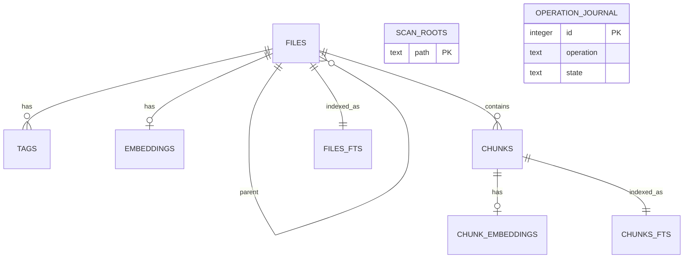
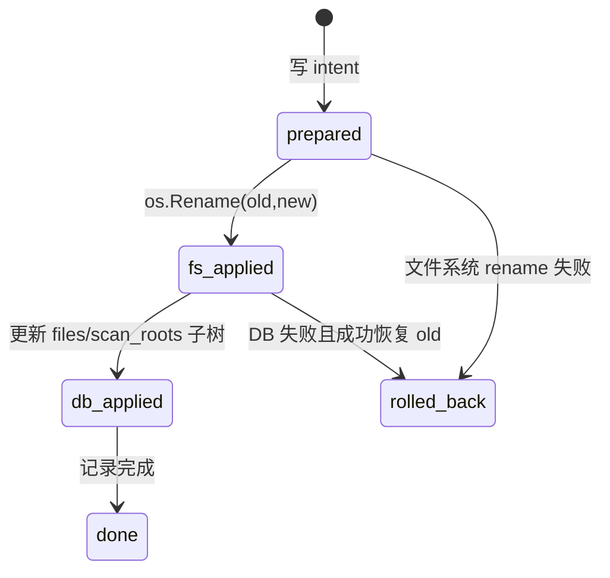
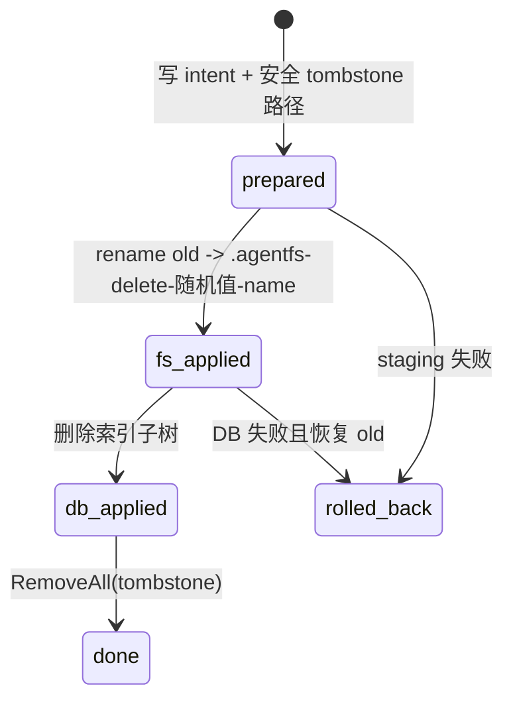

# 数据模型与崩溃恢复

## 1. 数据所有权

真实文件系统是事实源，SQLite 是派生索引。数据库可以重建；它不保存完整文件的权威副本，也不应
成为恢复用户文件的备份。

当前 `PRAGMA user_version = 1`。社区版会拒绝：

- 非 0/1 schema 版本；
- `files` 表含 `mode`、`uid`、`gid` 的权限感知数据库；
- 没有 `scan_root` 的旧 Python 索引。

遇到不兼容 schema 时应选择新的 `--db` 路径并重新扫描。

## 2. 实体关系



## 3. 表说明

### `files`

每个已索引路径一行。`path` 全局唯一且为绝对 clean path；`parent_id` 构成目录树；`scan_root` 表示
负责 reconciliation 的 root。`kind` 为 `file`、`dir`、`symlink`、`other`。

`content_head` 是有界文本预览，`content_hash` 是提取文本 SHA-256，`mime` 来自格式或内容探测，
`tags_text` 是由 trigger 维护的冗余搜索字段。`symbols_text` 已预留，但当前检索主要读取 `chunks.symbol`。

### `tags`

`(file_id, tag)` 复合主键。insert/delete trigger 会按排序重建 `files.tags_text`，从而在同一事务中更新
文件 FTS 内容。

### `scan_roots`

记录每个完整扫描 root 的最后扫描时间、耗时和条目数，用于诊断和未来指标，不参与 MCP 返回。

### `chunks` / `chunk_embeddings`

Chunk 按 `(file_id, ordinal)` 唯一，保存语言、symbol、范围、内容 hash。Embedding 与 Chunk 一对一，
记录模型、维度、bucket、float32 BLOB 和生成时使用的内容 hash。

### `embeddings`

每个文件一条当前向量，输入由 `name + path + content_head` 组成。`model,bucket` 索引用于候选召回。

### `files_fts` / `chunks_fts`

两个 external-content FTS5 虚拟表使用 `unicode61 remove_diacritics 2` tokenizer。insert/delete/update trigger
让 FTS 与源表处在同一 SQLite 事务。`rowid` 分别等于 `files.id` 与 `chunks.id`。

### `operation_journal`

只记录 Agent-FS 主动执行的 `rename` 与 `remove`，不是通用审计日志。保留 old/new/stage path、状态、
最后错误与时间戳。完成记录当前不会自动清理。

## 4. 扫描事务

完整扫描在进入事务前完成所有文件读取、解析和 Embedding。提交阶段负责：

目录遍历会先按共享排除策略剪枝；这些路径不会进入采集集合，也会在事务的 stale reconciliation 中
从旧索引移除。

1. upsert `files`；
2. 建立 parent 关系；
3. 替换变化文件的 Chunk 与向量；
4. 应用 root tags；
5. 删除本次未观察到的 stale 路径；
6. 更新 `scan_roots`；
7. commit。

任一步骤失败都会 rollback，旧索引快照保持可用。代价是大型完整扫描会在事务外保留采集结果，内存
规模与路径数、预览和 Chunk 量相关。

## 5. 增量事务

事件批次被分为存在条目与 missing paths。存在条目重新执行 `describePath`；提交时用批量 SQL upsert
文件、删除/写入发生变化的 Chunk/Embedding，最后批量删除 missing 文件或目录子树。

数据库 artifacts（主 DB、`-wal`、`-shm`、`-journal`）永远从扫描与 watcher 事件中过滤，避免索引
自身造成更新环路。

## 6. Rename 状态机



重启恢复以文件系统与索引的组合状态为依据：

- 只有 new 存在：必要时把 old 索引子树更新为 new，然后标记 done。
- 只有 old 存在：必要时把索引回滚到 old，然后标记 rolled_back。
- old/new 都存在或都不存在：状态歧义，停止启动并要求人工处理。

## 7. Remove 状态机

删除不会立即 `RemoveAll(old)`：



恢复代码先验证 tombstone 必须与 old 同目录且 basename 以 `.agentfs-delete-` 开头，防止操作日志被用来
删除任意路径。old 消失而 tombstone 存在时，会补齐索引删除并清理 tombstone；两者都消失时也会
确保索引删除。两者都存在则停止，避免猜测用户意图。

## 8. 诊断 SQL

```bash
agent-fs query 'SELECT path,last_scan_ns,last_duration_ns,entry_count FROM scan_roots'
agent-fs query 'SELECT operation,state,old_path,new_path,stage_path,last_error FROM operation_journal ORDER BY id DESC LIMIT 20'
agent-fs query 'SELECT model,dimensions,count(*) FROM embeddings GROUP BY model,dimensions'
agent-fs doctor
```

通过 `query` 只能读取。不要直接用外部 sqlite client 修改运行中的数据库；这会绕过触发器之外的代码
不变量和恢复状态机。
