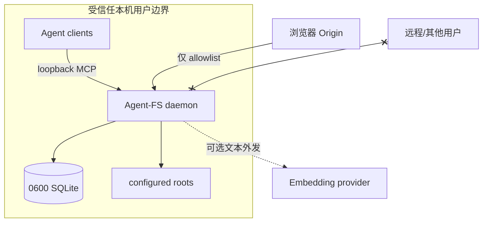

# 安全模型与社区版边界

## 1. 使用场景

Agent-FS Community 适用于一个受信任用户在自己的开发机上，让该用户启动的 Agent 访问该用户明确
配置的代码/文档 root。它不是共享服务、团队服务或互联网服务。

## 2. 明确不包含的能力

- HTTP/MCP 认证；
- 用户、租户和 workspace 隔离；
- 基于文件 mode/uid/gid 的 ACL；
- 每次查询/工具调用的审计日志；
- TLS、密钥轮换和远程 secret 管理；
- 管理控制面、配额和企业 SLA。

loopback-only 是网络缩小措施，不是身份认证。同一机器上能连接该端口的不可信进程仍可读取检索结果。

## 3. 资产

需要保护的内容包括：

- 被索引文件的路径、预览和 Chunk；
- 文件与 Chunk Embedding，它们仍可能泄露内容特征；
- 标签和工作目录结构；
- 外部 Embedding API key；
- operation journal 中的文件路径；
- MCP response 与客户端日志中的上下文。

SQLite 数据库应按源代码同等敏感级别处理。

## 4. 信任边界

## 5. 当前防护

| 防护 | 当前实现 | 不能解决 |
|---|---|---|
| loopback 检查 | CLI 只接受 localhost/loopback IP | 本机恶意进程、代理/tunnel |
| Origin allowlist | 带 Origin 请求需 exact match | 非浏览器客户端、认证 |
| 数据库权限 | 父目录 0700、DB 0600 | 运行用户自身的恶意进程 |
| bounded body | 默认最多读取 1 MiB JSON | 大量小请求 DoS |
| HTTP timeout | read/write/idle timeout | 本地高 QPS 资源消耗 |
| 只读 MCP | 仅 search/context_pack | 敏感内容读取本身 |
| 只读 SQL | 单语句白名单 + query_only | 已索引数据的授权隔离 |
| 安全删除 staging | 同目录随机 tombstone + 恢复校验 | 用户主动误删目标 |
| 索引 artifacts 排除 | 防自索引循环与 DB 内容进入索引 | root 中其他 secrets |

## 6. 安全部署清单

- 只绑定 `127.0.0.1`、`localhost` 或 `[::1]`。
- 不使用 SSH reverse tunnel、公开 reverse proxy、容器端口映射或 host network 暴露服务。
- 只索引完成任务所需 root，不要直接索引整个 home、密码库、浏览器 profile 或 SSH 配置。
- daemon 与客户端以同一普通用户运行，不用 root。
- 数据库放在 0700 用户数据目录，备份同样加密/限制权限。
- 外部 Embedding 前确认数据会离开机器；优先使用本机 provider。
- API key 放 0600 EnvironmentFile，不写 CLI history、unit 命令、仓库或数据库。
- 定期更新依赖并运行 `go test -race ./...` 和安全扫描。

## 7. 浏览器访问

Origin allowlist 只在请求带 `Origin` header 时生效。配置必须使用完整 origin：scheme、host、port；
路径不属于 origin。不要把 `--allow-origin` 当 CORS 通配认证，也不要允许来自不可信网页的 origin，
因为网页可把索引内容发送到其服务器。

## 8. 外部 Embedding

HTTP embedder 会发送：

- 索引时：文件 name/path/content preview 以及每个 Chunk 的 symbol/content；
- 查询时：用户的完整 search/context query。

因此即使 MCP 仅本机可见，远程 Embedding 也会形成第二个数据边界。provider URL 允许 HTTP；只有确实
在 loopback/受控私网时才使用明文 HTTP，公网 endpoint 必须使用 HTTPS。

## 9. 文件操作风险

CLI `rename` 和 `rm` 会真实修改文件，且 `rm --recursive` 最终调用递归删除 tombstone。代码会拒绝文件
系统根与包含索引数据库的目标，并为崩溃恢复记录 intent；这些机制不能判断用户是否选错了业务路径。
执行前仍应使用版本控制或备份，并先核对绝对路径。

## 10. 共享/远程需求

一旦出现下列任一条件，不应继续用社区 daemon 直接满足：

- 多个 OS 用户；
- 跨机器或公网访问；
- 不同项目需要强隔离；
- 合规要求每次访问可审计；
- 服务账户应只能读取部分文件；
- 需要撤销 token、速率限制或集中策略。

这些场景需要认证、授权、租户隔离、审计、TLS 和运维控制面，是与社区版本地信任模型不同的产品。

## 11. 漏洞报告

不要在公开 issue 中粘贴 secret、私有路径、数据库或源代码。按仓库根目录
[`SECURITY.md`](../SECURITY.md) 私下联系维护者，并提供版本、OS、最小复现、攻击者位置（本机/远程）
和预期影响。

